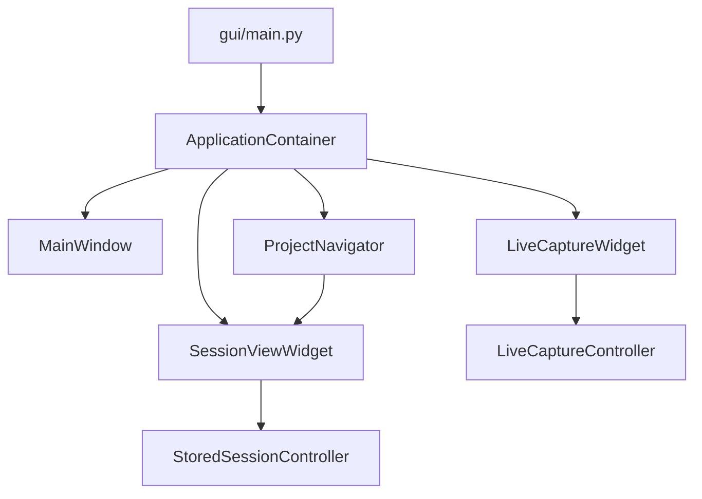

# Kompozycja zależności aplikacji

Jedynym miejscem budowania głównych zależności GUI jest
`gui/application_container.py`. Punkt wejścia `gui/main.py` tworzy
`ApplicationContainer`, a następnie prosi go o utworzenie głównego okna.

## Odpowiedzialności

| Element | Odpowiedzialność |
|---|---|
| `ApplicationContainer` | Tworzy kontrolery, widoki, nawigator, zadania importu i adapter infrastruktury desktopowej. |
| `MainWindow` | Łączy sygnały GUI i obsługuje interakcje użytkownika; nie wybiera implementacji kontrolerów. |
| `ProjectNavigator` | Rejestruje, aktywuje i zamyka zakładki oraz tworzy widoki zapisanych sesji przez wstrzykniętą fabrykę. |
| `LiveCaptureController` | Tworzy `CaptureService`, mapuje konfigurację i zarządza lifecycle rejestracji. |
| `StoredSessionController` | Zarządza filtrami, stronicowaniem i asynchronicznym odczytem zapisanej sesji. |
| `SessionManagementIntegration` | Łączy menu sesji z use case'ami `app/session_management.py` i adapterem desktopowym. |

## Reguły kompozycji

- `gui/main.py` nie uruchamia funkcji instalujących ani nie modyfikuje klas w runtime.
- Kontrolery Live i zapisanej sesji są tworzone przez kontener przed utworzeniem widoku.
- Widoki nadal mają wartości domyślne konstruktorów dla izolowanych testów i narzędzi, ale produkcyjny punkt wejścia zawsze przekazuje jawne zależności.
- Operacje systemowe są dostarczane przez `infrastructure/desktop.py`.
- `CaptureService`, lifecycle CANlib i tor zapisu sesji nie są częścią kompozycji Qt i pozostają pod kontrolą warstwy aplikacyjnej.
