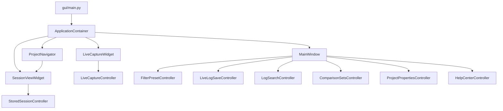

# Kompozycja zależności aplikacji

Jedynym miejscem budowania głównych zależności GUI jest
`gui/application_container.py`. Punkt wejścia `gui/main.py` tworzy
`ApplicationContainer`, a następnie prosi go o utworzenie głównego okna.

```mermaid
flowchart TD
    Main["gui/main.py"] --> Container["ApplicationContainer"]
    Container --> Window["MainWindow"]
    Container --> Live["LiveCaptureWidget"]
    Container --> Stored["SessionViewWidget"]
    Container --> Navigator["ProjectNavigator"]
    Live --> LiveController["LiveCaptureController"]
    Stored --> StoredController["StoredSessionController"]
    Navigator --> Stored
    Window --> Filters["FilterPresetController"]
    Window --> LiveLog["LiveLogSaveController"]
    Window --> Search["LogSearchController"]
    Window --> Comparison["ComparisonSetsController"]
    Window --> Properties["ProjectPropertiesController"]
    Window --> Help["HelpCenterController"]
```

## Odpowiedzialności

| Element | Odpowiedzialność |
|---|---|
| `ApplicationContainer` | Tworzy kontrolery, widoki, nawigator, zadania importu i adapter infrastruktury desktopowej. |
| `MainWindow` | Jedna klasa okna: akcje, menu, docki, zakładki, pasek stanu i lifecycle aktywnego projektu. Funkcje dodatkowe deleguje do kontrolerów poniżej przez jawne wywołania; nie wybiera implementacji kontrolerów aplikacyjnych. |
| `FilterPresetController` | Nie-modalne okno filtrów globalnych i skróty presetów (walidacja kompilatorem statycznym v2). |
| `LiveLogSaveController` | Jawne zapisanie zakończonego tymczasowego logu Live jako sesji projektu; pyta o niezapisany log przy zmianie projektu, zamknięciu zakładki i programu. |
| `LogSearchController` | Okno Ctrl+F, rejestr indeksów wyszukiwania, trwałe indeksy sesji i postęp przygotowania projektu. |
| `ComparisonSetsController` | Zakładka zestawów porównawczych i nawigacja od analiz do dowodów w surowych ramkach. |
| `ProjectPropertiesController` | Edycja właściwości projektu, pojazdu i ECU z wycofaniem zmian przy błędzie zapisu. |
| `HelpCenterController` | Zakładka Pomocy CRT i okno „O programie”. |
| `ProjectNavigator` | Rejestruje, aktywuje i zamyka zakładki oraz tworzy widoki zapisanych sesji przez wstrzykniętą fabrykę. |
| `LiveCaptureController` | Tworzy `CaptureService`, mapuje konfigurację i zarządza lifecycle rejestracji. |
| `StoredSessionController` | Zarządza filtrami, stronicowaniem i asynchronicznym odczytem zapisanej sesji. |
| `SessionManagementIntegration` | Łączy menu sesji z use case'ami `app/session_management.py` i adapterem desktopowym. |

## Reguły kompozycji

- `gui/main.py` nie uruchamia funkcji instalujących ani nie modyfikuje klas w runtime.
- Główne okno nie jest rozszerzane dziedziczeniem. Nowa funkcja okna to osobny kontroler (`QObject`) tworzony w `MainWindow.__init__`, który korzysta wyłącznie z publicznego API okna (`project`, `tabs`, `navigator`, `explorer`, `inspector`, `append_output()`, `services`). Kroki zmiany projektu, zamknięcia zakładki i zamknięcia programu są wypisane wprost w `set_project()`, `_close_tab()` i `closeEvent()`.
- Kontrolery Live i zapisanej sesji są tworzone przez kontener przed utworzeniem widoku.
- Widoki nadal mają wartości domyślne konstruktorów dla izolowanych testów i narzędzi, ale produkcyjny punkt wejścia zawsze przekazuje jawne zależności.
- Operacje systemowe są dostarczane przez `infrastructure/desktop.py`.
- `CaptureService`, lifecycle CANlib i tor zapisu sesji nie są częścią kompozycji Qt i pozostają pod kontrolą warstwy aplikacyjnej.
